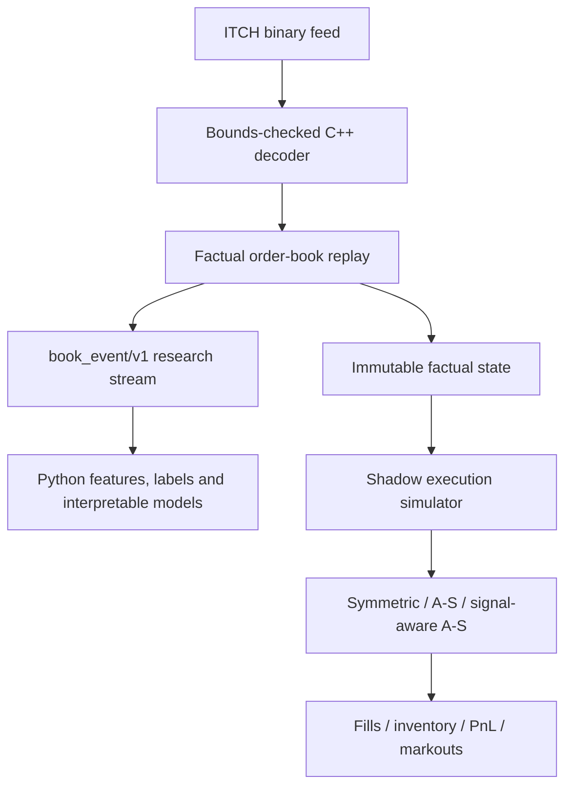

# LOBForge

Deterministic C++20 limit-order-book infrastructure for factual ITCH replay, leakage-controlled
microstructure research, and offline counterfactual market-making simulation.

> **Release-candidate status:** engineering Rounds 1–4 are implemented and locally validated on
> license-safe synthetic fixtures. No lawful real-market dataset is present, so real replay,
> out-of-sample robustness, alpha and profitability evidence remain
> `BLOCKED: DATASET_NOT_PROVIDED`. LOBForge is an offline research system, not a production or live
> trading platform.

## Evidence at a glance

These are reproducible engineering measurements, not trading-performance claims. The unified
[claims and evidence index](docs/claims_and_evidence.md) records commands, environments and limits.

| Result | Measurement | Environment and data | Scope |
|---|---:|---|---|
| ITCH coverage | 23/23 application message types | C++20; synthetic literal-hex fixtures | June 11, 2026 TotalView-ITCH 5.0 specification |
| Cross-toolchain regression | 14/14 CTest on Linux GCC, Linux Clang and Windows GCC | Release builds; synthetic fixtures | Round 1–4 registered suite |
| Python validation | 65/65 pytest; 95.16% branch coverage | CPython 3.11.9; selected ten Round 3/4 core modules | Not whole-repository coverage |
| Shadow-simulator performance | median 1,612,653.525 facts/s; p99 2.8 us; peak RSS 74,203,136 B | Ryzen 7 5800H, WSL2 (2 logical CPUs), GCC 11.4, `-O3 -DNDEBUG`; synthetic | Fresh Round 4.5 audit; five 1,000,000-event runs |
| Deterministic audit | `49c0a04b17a0de32` | GCC/Clang and chunk sizes 1/1,024/65,536; synthetic | Round 4 canonical logical content |

The planted inventory-pressure control reduced time-weighted absolute inventory by 81.9%, but that
number is deliberately excluded from the headline table: it validates implementation response in a
synthetic scenario and says nothing about real-market strategy quality or profit.

## Five-minute synthetic quickstart

Requirements: CMake 3.20+, Ninja, a C++20 compiler, Python 3.11+ for the research package and
[`uv`](https://docs.astral.sh/uv/). Run from the repository root on Linux or WSL:

```sh
cmake -S . -B build -G Ninja -DCMAKE_BUILD_TYPE=Release
cmake --build build
ctest --test-dir build --output-on-failure

./build/lobforge_mm_sim \
  --synthetic-fixture primary \
  --config configs/round4_protocol.toml \
  --output-dir artifacts/round4_primary

cd python
uv sync --frozen --all-groups
uv run lobforge-research round4-analyze \
  --input ../artifacts/round4_primary \
  --output ../artifacts/round4_analysis
uv run lobforge-research round4-synthetic-report \
  --output ../artifacts/round4_controls
```

The generated audits, metrics and figures are local artifacts and are ignored by Git. The fixture
is deterministic and synthetic; it is not exchange data and its PnL is not real money.

## Architecture



The semantic boundary is intentional:

- **Factual reconstruction** applies only events reported by ITCH. It never rematches the feed or
  inserts hypothetical orders.
- **Counterfactual matching** in Round 1 answers what a caller-supplied command would execute under
  local price-time rules.
- **Shadow execution** in Round 4 observes factual state read-only. Its orders, queue position,
  fills and accounting live in a separate domain and cannot contaminate the historical book.
- **Research features** consume the versioned NDJSON boundary. Python does not implement an ITCH
  parser or a second factual book.

See [ADR 0002](docs/adr/0002-counterfactual-matching-versus-factual-reconstruction.md) and
[ADR 0004](docs/adr/0004-shadow-queue-and-fill-semantics.md) for the exact separation.

## What is implemented

### Round 1 — deterministic matching engine

- Integer prices and quantities, price-time priority and atomic validation.
- GTC, IOC, FOK, PostOnly and market-order policies.
- New, cancel, reduce and replace semantics with checked aggregate arithmetic.
- A scan-based differential oracle over 100,000 randomized commands.

The public C++ API is in [the order-book header](include/lob/order_book.hpp); exact behavior and
complexity are in [ADR 0001](docs/adr/0001-matching-engine-semantics.md) and the
[Round 1 report](docs/round1_report.md).

### Round 2 — safe ITCH 5.0 replay

- Typed, field-complete decoding for all 23 application-message types.
- Explicit bounds-checked big-endian reads and 48-bit nanoseconds-since-midnight timestamps.
- Factual multi-symbol displayed book, reference/session state and trade ledger.
- Strict/permissive error contracts, canonical state serialization and deterministic replay CLI.
- Versioned `book_event/v1` NDJSON exporter with integer Price(4) values.

The normative matrix is [ITCH coverage](docs/itch50_coverage.md); the CLI and research contracts are
[replay CLI](docs/replay_cli.md) and [book_event/v1](docs/book_event_v1.md).

### Round 3 — leakage-controlled research pipeline

- Bounded streaming validation from NDJSON to fixed-schema Arrow/Parquet batches.
- Exact `mid2`, spread, L1/L5/L10 imbalance, weighted midpoint and Cont-style OFI.
- A train-only Stoikov-style finite-state first-adjustment microprice with explicit failure reasons.
- Event-time and right-continuous clock-time labels.
- Global chronological date splits, purge, train-only fitting, calibration and block inference.
- Positive, null and shuffled synthetic controls; no random row split.

Definitions and limitations are in the [feature dictionary](docs/feature_dictionary.md),
[methodology](docs/round3_methodology.md) and [leakage audit](docs/round3_leakage_audit.md).

### Round 4 — offline shadow execution

- Deterministic market/compute/order/cancel/replace latency scheduling.
- FIFO MBO queue evidence plus explicit alternative queue models.
- Exact nanodollar cash, inventory, fees, realized/unrealized PnL and markout accounting.
- Risk gating, stop switch and forced cancellation.
- Symmetric quoting, Avellaneda–Stoikov and signal-aware A-S strategies.
- Independent Python scalar oracles, planted/null controls and versioned audit streams.

This simulator does not model market impact, hidden liquidity, behavioral response by other
participants or guaranteed fills. See the [Round 4 architecture](docs/round4_architecture.md),
[methodology](docs/round4_methodology.md) and [validation report](docs/round4_validation_report.md).

## Technology and platform support

- **C++:** C++20 standard library, CMake and optional Ninja; no third-party runtime library.
- **Python:** Python 3.11+, NumPy, PyArrow, SciPy, scikit-learn and Matplotlib.
- **Quality:** CTest, pytest/Hypothesis, branch coverage, Ruff, strict mypy, clang-format,
  ASan/UBSan/LSan and Clang libFuzzer.
- **Verified platforms:** Linux/WSL GCC and Clang Release; Windows MinGW GCC Release.
- **Not claimed:** MSVC validation, macOS validation, hard real-time behavior or production support.

The exact Python graph is in `python/uv.lock`. Third-party origins and licensing constraints are in
[THIRD_PARTY_NOTICES.md](THIRD_PARTY_NOTICES.md).

## Build and test

Linux/WSL GCC:

```sh
cmake -S . -B build-gcc -G Ninja \
  -DCMAKE_BUILD_TYPE=Release -DCMAKE_CXX_COMPILER=g++
cmake --build build-gcc
ctest --test-dir build-gcc --output-on-failure
```

Linux/WSL Clang:

```sh
cmake -S . -B build-clang -G Ninja \
  -DCMAKE_BUILD_TYPE=Release -DCMAKE_CXX_COMPILER=clang++
cmake --build build-clang
ctest --test-dir build-clang --output-on-failure
```

Windows PowerShell with MinGW GCC and Ninja on `PATH`:

```powershell
cmake -S . -B build-windows -G Ninja `
  -DCMAKE_BUILD_TYPE=Release -DCMAKE_CXX_COMPILER=g++
cmake --build build-windows
ctest --test-dir build-windows --output-on-failure
```

Python validation:

```sh
cd python
uv sync --frozen --all-groups
uv run ruff check src tests
uv run ruff format --check src tests
uv run mypy src
LOBFORGE_REPLAY_CLI=../build/lobforge_replay uv run pytest -q \
  --cov=lobforge_research.features \
  --cov=lobforge_research.labels \
  --cov=lobforge_research.splits \
  --cov=lobforge_research.microprice \
  --cov=lobforge_research.evaluation \
  --cov=lobforge_research.round4_oracle \
  --cov=lobforge_research.round4_evaluation \
  --cov=lobforge_research.round4_synthetic \
  --cov=lobforge_research.round4_reporting \
  --cov=lobforge_research.round4_calibration \
  --cov-branch --cov-report=term-missing --cov-fail-under=90
```

Sanitizer and fuzz examples use Clang on Linux/WSL:

```sh
cmake -S . -B build-sanitize -G Ninja \
  -DCMAKE_BUILD_TYPE=Debug -DLOB_ENABLE_SANITIZERS=ON \
  -DCMAKE_CXX_COMPILER=clang++
cmake --build build-sanitize
ASAN_OPTIONS=detect_leaks=1:halt_on_error=1 \
UBSAN_OPTIONS=halt_on_error=1:print_stacktrace=1 \
ctest --test-dir build-sanitize --output-on-failure

cmake -S . -B build-fuzz -G Ninja \
  -DCMAKE_BUILD_TYPE=Debug -DLOB_ENABLE_SANITIZERS=ON \
  -DLOB_BUILD_FUZZING=ON -DCMAKE_CXX_COMPILER=clang++
cmake --build build-fuzz
./build-fuzz/itch_replay_tests --write-fuzz-corpus build-fuzz/fuzz-corpus
./build-fuzz/itch_fuzz build-fuzz/fuzz-corpus -max_total_time=30 -timeout=5
./build-fuzz/mm_fuzz -max_total_time=30 -timeout=5
```

## Benchmarks

Generate inputs before timing, use Release binaries and keep shared-runner CI to smoke workloads:

```sh
./build/order_book_benchmark
./build/itch_replay_benchmark
./build/mm_benchmark --events 1000000 --runs 5 --warmup 100000
```

Benchmark programs report deterministic checksums and disclose warm-up, timed work and compiler
flags. Results are machine-specific; do not compare isolated best runs. Methodology and full run
vectors are in the [Round 1](docs/round1_report.md), [Round 2](docs/round2_benchmark.md),
[Round 3](docs/round3_benchmark.md) and [Round 4](docs/round4_benchmark.md) reports.

## Documentation map

| Area | Primary documents |
|---|---|
| Semantics and boundaries | [ADR index](docs/adr/0001-matching-engine-semantics.md), [factual vs counterfactual](docs/adr/0002-counterfactual-matching-versus-factual-reconstruction.md) |
| ITCH replay | [coverage](docs/itch50_coverage.md), [CLI](docs/replay_cli.md), [Round 2 validation](docs/round2_validation_report.md) |
| Research data | [book_event/v1](docs/book_event_v1.md), [features](docs/feature_dictionary.md), [Round 3 validation](docs/round3_validation_report.md) |
| Shadow simulation | [architecture](docs/round4_architecture.md), [audit schemas](docs/shadow_audit_v1.md), [metrics](docs/round4_metrics.md), [Round 4 validation](docs/round4_validation_report.md) |
| Public release | [claims/evidence](docs/claims_and_evidence.md), [release audit](docs/round4_5_release_audit.md), [release runbook](docs/public_release_runbook.md) |

## Data, privacy and security policy

- No real or licensed market-data file is committed. The repository contains only small,
  explicitly synthetic or literal golden fixtures.
- Raw ITCH, DBN, PCAP, Parquet, Arrow, Feather, model and local-environment outputs are ignored.
- The release audit scans the worktree and all local Git blobs, including reachable and
  unreachable objects, without printing matched secret text; it also validates Markdown links and
  produces a logical release manifest.
- Generated datasets, reports, models, virtual environments and benchmark outputs remain local.
- Users are responsible for data-provider licenses, provenance, retention and permitted research
  use before supplying their own data.

Reproduce the local public-release check with:

```sh
python tools/release_audit.py --manifest artifacts/round4_5/release_manifest.json \
  --no-write --verify-existing
```

## Limitations and non-claims

LOBForge does **not** provide live feeds, SoupBinTCP/MoldUDP64 gap recovery, broker or exchange order
entry, queue guarantees, market-impact estimation, paper/live trading, deployment operations or
production monitoring. The research layer does not establish NBBO validity, causal alpha,
execution feasibility or risk-adjusted returns. Negative metrics are valid outcomes and are not
retuned away.

Current real-data status is intentionally separate from engineering validation:

| Evidence gate | Status |
|---|---|
| F1 — real-data provenance | `BLOCKED: DATASET_NOT_PROVIDED` |
| F2 — real counterfactual replay | `BLOCKED: DATASET_NOT_PROVIDED` |
| F3 — out-of-sample robustness | `BLOCKED: DATASET_NOT_PROVIDED` |
| P1 — profitability evidence | `BLOCKED: DATASET_NOT_PROVIDED` |

## License

LOBForge is licensed under the [Apache License 2.0](LICENSE), with
`Copyright 2026 Haoxiang Sang` recorded in [NOTICE](NOTICE). Third-party dependencies and research
references retain their own terms; see [THIRD_PARTY_NOTICES.md](THIRD_PARTY_NOTICES.md). The license
does not change the project's real-data, profitability, production-readiness or live-trading
evidence boundaries.

## Round 5 roadmap

Round 5 is limited to lawful real-data evidence: provenance verification, complete-session replay,
pre-registered date/symbol coverage and one-time out-of-sample evaluation. It does not relax the
engineering/empirical/profitability separation and does not add live trading. See the
[public-release runbook](docs/public_release_runbook.md) for steps that must occur before any public
visibility change.
